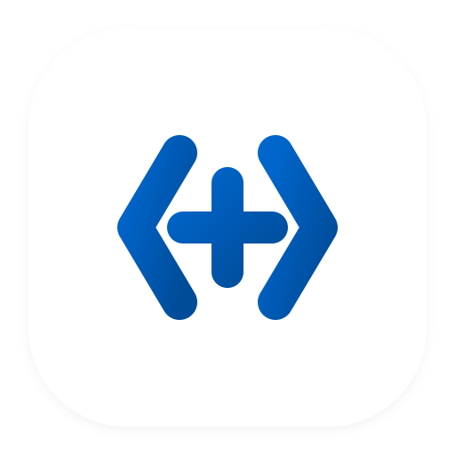
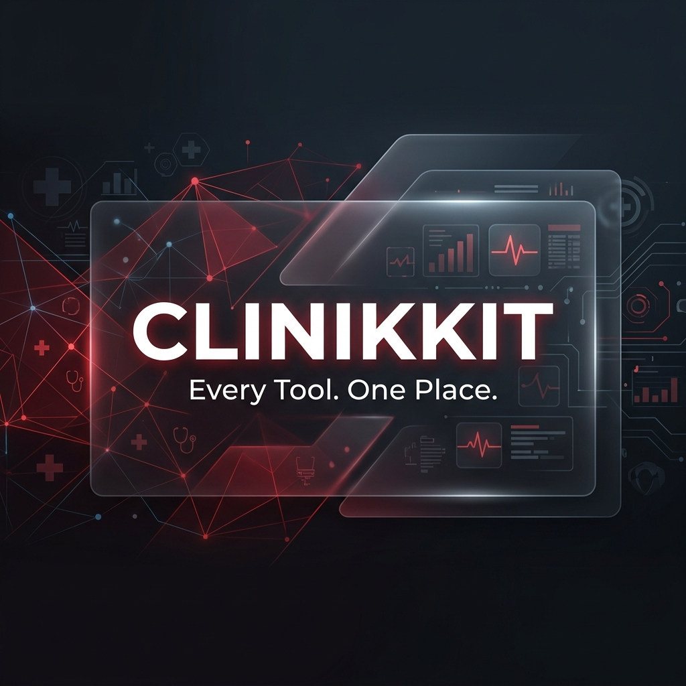

<div align="center">
  
  
  # Clinikkit – Every Tool. One Place.
  
  **A scalable, lightning-fast, privacy-first platform offering clinical medical calculators, advanced developer utilities, and everyday tools.**

  [](https://nextjs.org/)
  [](https://tailwindcss.com/)
  [](https://firebase.google.com/)
  
  
</div>

## ✨ Features

- ⚡ **Blazing Fast**: Uses Next.js `output: export` to compile the entire site into pure static HTML, CSS, and JS. Zero server delays.
- 🔍 **Perfect SEO**: Dynamic routing automatically injects Metadata (Title, Description, Keywords, OpenGraph) generated dynamically at build time for every single tool.
- 🧩 **Modular Tool Architecture**: A highly scalable registry pattern. Adding a new tool takes only a few minutes and keeps the codebase incredibly organized.
- 🎨 **Beautiful UI**: Built with `shadcn/ui` and Tailwind CSS. Modern, dark-mode ready, premium styling out of the box.
- 🆓 **100% Free Hosting**: Designed from the ground up to be fully compatible with Firebase Hosting's Free Tier (Spark Plan).

---

## 🛠️ Tech Stack

- **Framework**: [Next.js 15 (App Router)](https://nextjs.org/)
- **Language**: [TypeScript](https://www.typescriptlang.org/)
- **Styling**: [Tailwind CSS v4](https://tailwindcss.com/)
- **UI Components**: [shadcn/ui](https://ui.shadcn.com/)
- **Icons**: [Lucide React](https://lucide.dev/)
- **Deployment**: [Firebase Hosting (Static Export)](https://firebase.google.com/docs/hosting)

---

## 🚀 Getting Started

### Prerequisites

Ensure you have [Node.js](https://nodejs.org/) installed on your machine.

### Local Installation

1. **Clone the repository:**
   ```bash
   git clone https://github.com/kk0krishna/AllTools.git
   cd AllTools
   ```

2. **Install the dependencies:**
   ```bash
   npm install
   ```

3. **Run the development server:**
   ```bash
   npm run dev
   ```

4. Open [http://localhost:3000](http://localhost:3000) in your browser to see the app running locally.

---

## ➕ Adding a New Tool

To ensure the codebase scales well to hundreds of tools, we use a modular registry pattern. Follow these simple steps to add a new tool:

1. **Create the Tool Folder**:
   Create a new folder in `src/tools/<category>/<tool-slug>/`. *(For example: `src/tools/finance/gst-calculator/`)*.

2. **Create the Component (`index.tsx`)**:
   Build your interactive React component here using `shadcn/ui` and standard React hooks.

3. **Create the Metadata (`metadata.tsx`)**:
   Define the tool's SEO metadata and documentation content:
   ```tsx
   import { ToolEntry } from "@/tools/registry";
   import { GSTCalculator } from "./index";

   export const gstCalculatorEntry: ToolEntry = {
     metadata: {
       name: "GST Calculator",
       description: "Calculate GST instantly...",
       category: "finance",
       slug: "gst-calculator",
       keywords: ["gst", "tax calculator"],
     },
     component: GSTCalculator,
     content: () => (
       <>
         <h2>How to calculate GST</h2>
         <p>Documentation goes here...</p>
       </>
     ),
   };
   ```

4. **Register the Tool**:
   Open `src/tools/registry.ts` and add your new `ToolEntry` to the `toolsRegistry` array. Next.js will automatically generate the static route, sitemap, and SEO tags on the next build!

---

## ☁️ Deployment (Firebase Hosting)

Because this project uses Next.js Static Export, it is perfectly compatible with the **free tier (Spark Plan)** of Firebase Hosting.

1. **Install Firebase CLI and Login:**
   ```bash
   npm install -g firebase-tools
   firebase login
   ```

2. **Build the static site:**
   ```bash
   npm run build
   ```
   *(This compiles all pages and assets into the `out/` directory).*

3. **Deploy to Firebase:**
   ```bash
   firebase deploy --only hosting
   ```

---

## 👨‍💻 Developer & Maintainer

**Krishna KK**
- **GitHub**: [@kk0krishna](https://github.com/kk0krishna)
- **Project Link**: [https://github.com/kk0krishna/AllTools](https://github.com/kk0krishna/AllTools)

Clinikkit was developed by Krishna KK with a passion for delivering fast, high-performance applications. Designed as a reliable alternative to online tools that often feature intrusive ads, paywalls, or slow server-side processing, this platform reflects a commitment to clean engineering and clinical precision.

Contributions, issues, and feature requests are always welcome! Feel free to check the [issues page](https://github.com/kk0krishna/AllTools/issues) if you want to contribute.

---

## 📝 License

This project is open-source and free to use.
